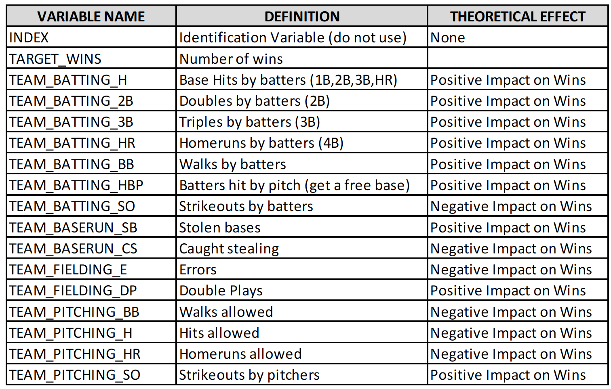

```{r setup, include=FALSE}
knitr::opts_chunk$set(echo = TRUE)
```

```{r message=FALSE, warning=FALSE, include=FALSE, paged.print=FALSE}
library(ggplot2)
library(ggfortify)
library(gridExtra)
library(forecast)
library(fpp2)
library(fma)
library(kableExtra)
library(e1071)
library(mlbench)
library(ggcorrplot)
library(DataExplorer)
library(timeDate)
library(caret)
library(tibble)
library(dplyr)
library(tidyverse)
library(tidyr)

df <- read.csv('datasets/moneyball-training-data.csv')
```

## Overview

In this homework assignment, you will explore, analyze and model a data set containing approximately 2200
records. Each record represents a professional baseball team from the years 1871 to 2006 inclusive. Each record
has the performance of the team for the given year, with all of the statistics adjusted to match the performance of
a 162 game season.

Your objective is to build a multiple linear regression model on the training data to predict the number of wins
for the team. You can only use the variables given to you (or variables that you derive from the variables
provided). Below is a short description of the variables of interest in the data set:



### Deliverables:

* A write-up submitted in PDF format. Your write-up should have four sections. Each one is described
below. You may assume you are addressing me as a fellow data scientist, so do not need to shy away
from technical details.
* Assigned predictions (the number of wins for the team) for the evaluation data set.
* Include your R statistical programming code in an Appendix.

```{r overview, echo=FALSE}

```

## 1. Data Exploration

Describe the size and the variables in the moneyball training data set. Consider that too much detail will cause a
manager to lose interest while too little detail will make the manager consider that you aren’t doing your job. Some
suggestions are given below. Please do NOT treat this as a check list of things to do to complete the assignment.
You should have your own thoughts on what to tell the boss. These are just ideas.

a. Mean / Standard Deviation / Median
b. Bar Chart or Box Plot of the data
c. Is the data correlated to the target variable (or to other variables?)
d. Are any of the variables missing and need to be imputed “fixed”?

```{r explore, echo=FALSE}
gather_df <- df %>% gather(key = 'variable', value = 'value', -INDEX, -TARGET_WINS)

gather_df %>% ggplot(aes(x = value, y = TARGET_WINS)) + geom_point() + facet_wrap(~variable, scales = 'free')

colSums(df %>% sapply(is.na))
```

Here we plot every variable against the target variable number of wins to get a feeling for which variables may be predictive of wins. The plots indicate some clear relationships, such as hitting more doubles or more home runs clearly improves the number of wins.

The plots also reveal significant issues with the data. First, there are many data points that contain missing data that will need to be either imputed or discarded. Second, it appears we have some missing data encoded as 0 and some nonsensical outliers.

There is a team with 0 wins in the dataset. This seems unlikely. Many of the hitting categories include teams at 0; it is unlikely that a team hit 0 home runs over the course of a season.

The pitching variables also include many 0's, for instance there are multiple teams with 0 strikeouts by their pitchers over the season which is extremely unlikely. The pitching data also includes strange outliers such as a team loggin 20000 strikeouts, that would be an average of 160 strikeouts per game which is impossible. Also team pitching walks and team pitching hits have strange outliers.

Lastly, the error variable makes no sense to me. From my experience watching baseball, teams usually score 2 or less errors per game, which would lead to an overall team error of approximately 320 over the course of a season, which does not match the scale of the error variable.

### Cleaning

```{r}
# We have chosen to impute the median as there are strong outliers that may skew the mean. Could revisit for advanced imputation via prediction later.

clean_df <- df %>% impute(what = 'median') %>% as.data.frame()

colSums(clean_df %>% sapply(is.na))
```

### Data Snapshot

#### Columns

Descriptive text ... Lorem ipsum dolor sit amet, consectetur adipiscing elit. Fusce ut augue pharetra, luctus lectus ut, rutrum quam. Aenean quis tellus ac felis accumsan pellentesque id ut purus. Fusce eget ligula eu est congue aliquet. Vivamus hendrerit felis varius lorem suscipit venenatis. Fusce facilisis arcu ac lorem cursus, non pretium velit finibus. Suspendisse eu nulla tellus. Nunc viverra elementum dolor, ut scelerisque nisl. Ut iaculis faucibus ultricies. Praesent fermentum eu libero et consequat. Phasellus vitae euismod lectus, a ultrices dui. Nunc vel leo rhoncus, cursus elit quis, rhoncus nisl. Aenean id urna et nibh tempor iaculis nec non quam. In tincidunt luctus ex eget viverra.

```{r columns, echo=FALSE}

```

#### Data Sample

```{r data, echo=FALSE}

```

#### Dimensions 

```{r dims, echo=FALSE}

```

#### Data Summary

### Variable Plots

#### Pairplot

#### Histograms

#### Distribution

#### Multicolinearlity

## 2. Data Preparation

Describe how you have transformed the data by changing the original variables or creating new variables. If you
did transform the data or create new variables, discuss why you did this. Here are some possible transformations.

a. Fix missing values (maybe with a Mean or Median value)
b. Create flags to suggest if a variable was missing
c. Transform data by putting it into buckets
d. Mathematical transforms such as log or square root (or use Box-Cox)
e. Combine variables (such as ratios or adding or multiplying) to create new variables

#### Missing Values

#### Outliers

#### Impute

## 3. Build Models

Using the training data set, build at least three different multiple linear regression models, using different variables
(or the same variables with different transformations). Since we have not yet covered automated variable
selection methods, you should select the variables manually (unless you previously learned Forward or Stepwise
selection, etc.). Since you manually selected a variable for inclusion into the model or exclusion into the model,
indicate why this was done.

Discuss the coefficients in the models, do they make sense? For example, if a team hits a lot of Home Runs, it
would be reasonably expected that such a team would win more games. However, if the coefficient is negative
(suggesting that the team would lose more games), then that needs to be discussed. Are you keeping the model
even though it is counter intuitive? Why? The boss needs to know.

## 4. Select Models

For the multiple linear regression model, will you use a metric such as Adjusted R2, RMSE, etc.? Be sure to
explain how you can make inferences from the model, discuss multi-collinearity issues (if any), and discuss other
relevant model output. Using the training data set, evaluate the multiple linear regression model based on (a)
mean squared error, (b) R2, (c) F-statistic, and (d) residual plots. Make predictions using the evaluation data set.

## References

- A
- B

## Appendix


### R Code

```{r appendix, echo=TRUE}

# Show all code here

```

