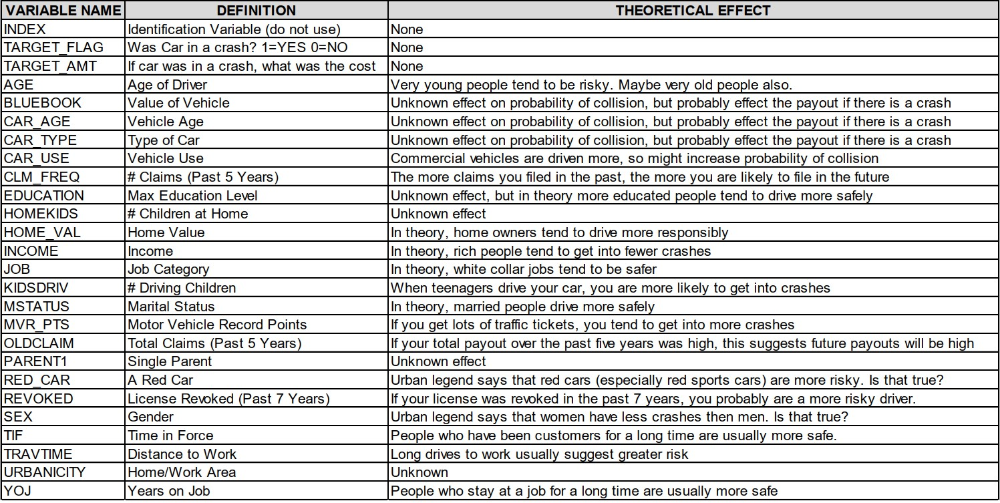

Source code: [https://github.com/djlofland/DS621_F2020_Group3/tree/master/Homework_4](https://github.com/djlofland/DS621_F2020_Group3/tree/master/Homework_4)

```{r setup, include=FALSE}
knitr::opts_chunk$set(echo = FALSE, warning = FALSE)
```

```{r echo=FALSE, message=FALSE, warning=FALSE, include=FALSE, paged.print=FALSE}
library(MASS)
library(scales)
library(rpart.plot)
library(ggplot2)
library(ggfortify)
library(gridExtra)
library(forecast)
library(fpp2)
library(fma)
library(kableExtra)
library(e1071)
library(mlbench)
library(ggcorrplot)
library(DataExplorer)
library(timeDate)
library(caret)
library(GGally)
library(corrplot)
library(RColorBrewer)
library(tibble)
library(tidyr)
library(tidyverse)
library(tidyselect)
library(dplyr)
library(reshape2)
library(mixtools)
library(tidymodels)
library(ggpmisc)
library(regclass)
library(pROC)
library(naniar)
library(RANN)
#' Print a side-by-side Histogram and QQPlot of Residuals
#'
#' @param model A model
#' @examples
#' residPlot(myModel)
#' @return null
#' @export
residPlot <- function(model) {
  # Make sure a model was passed
  if (is.null(model)) {
    return
  }
  
  layout(matrix(c(1,1,2,3), 2, 2, byrow = TRUE))
  plot(residuals(model))
  hist(model[["residuals"]], freq = FALSE, breaks = "fd", main = "Residual Histogram",
       xlab = "Residuals",col="lightgreen")
  lines(density(model[["residuals"]], kernel = "ep"),col="blue", lwd=3)
  curve(dnorm(x,mean=mean(model[["residuals"]]), sd=sd(model[["residuals"]])), col="red", lwd=3, lty="dotted", add=T)
  qqnorm(model[["residuals"]], main = "Residual Q-Q plot")
  qqline(model[["residuals"]],col="red", lwd=3, lty="dotted")
  par(mfrow = c(1, 1))
}
#' Print a Variable Importance Plot for the provided model
#'
#' @param model The model
#' @param chart_title The Title to show on the plot
#' @examples
#' variableImportancePlot(myLinearModel, 'My Title)
#' @return null
#' @export
variableImportancePlot <- function(model=NULL, chart_title='Variable Importance Plot') {
  # Make sure a model was passed
  if (is.null(model)) {
    return
  }
  
  # use caret and gglot to print a variable importance plot
  varImp(model) %>% as.data.frame() %>% top_n(n = 6) %>% 
    ggplot(aes(x = reorder(rownames(.), desc(Overall)), y = Overall)) +
    geom_col(aes(fill = Overall)) +
    theme(panel.background = element_blank(),
          panel.grid = element_blank(),
          axis.text.x = element_text(angle = 90)) +
    scale_fill_gradient() +
    labs(title = chart_title,
         x = "Parameter",
         y = "Relative Importance")
}
#' Print a Facet Chart of histograms
#'
#' @param df Dataset
#' @param box Facet size (rows)
#' @examples
#' histbox(my_df, 3)
#' @return null
#' @export
histbox <- function(df, box) {
    par(mfrow = box)
    ndf <- dimnames(df)[[2]]
    
    for (i in seq_along(ndf)) {
            data <- na.omit(unlist(df[, i]))
            hist(data, breaks = "fd", main = paste("Histogram of", ndf[i]),
                 xlab = ndf[i], freq = FALSE)
            lines(density(data, kernel = "ep"), col = 'red')
    }
    
    par(mfrow = c(1, 1))
}
#' Extract key performance results from a model
#'
#' @param model A linear model of interest
#' @examples
#' model_performance_extraction(my_model)
#' @return data.frame
#' @export
model_performance_extraction <- function(model=NULL) {
  # Make sure a model was passed
  if (is.null(model)) {
    return
  }
  
  data.frame("RSE" = model$sigma,
             "Adj R2" = model$adj.r.squared,
             "F-Statistic" = model$fstatistic[1])
}
#' Initial cleaning of the dataset
#'
#' @dataset dataset being cleaned, specific to insurance datasets
#' @return data.frame
#' @export
initial_cleaning<- function(dataset){
  
  dataset<-dataset %>% 
    dplyr::select(-INDEX) %>% 
    #converting the currency based columns to numeric
    mutate_at(vars(c("INCOME","HOME_VAL","OLDCLAIM","BLUEBOOK")),~as.numeric(str_replace_all(.,c("\\$"="","\\,"="")))) %>% 
    mutate_at(vars("TARGET_FLAG"),as.factor)
  
  return(dataset)
}
```


## 1. Data Exploration

*Describe the size and the variables in the insurance training data set. Consider that too much detail will cause a manager to lose interest while too little detail will make the manager consider that you aren't doing your job. Some suggestions are given below. Please do NOT treat this as a checklist of things to do to complete the assignment.
You should have your own thoughts on what to tell the boss. These are just ideas.*


```{r load_data, echo=FALSE}
# Load insurance dataset
df <- read.csv('https://raw.githubusercontent.com/djlofland/DS621_F2020_Group3/master/Homework_4/datasets/insurance_training_data.csv')
df_eval <- read.csv('https://raw.githubusercontent.com/djlofland/DS621_F2020_Group3/master/Homework_4/datasets/insurance-evaluation-data.csv')
```


Given that the Index column had no impact on the target variable, it was dropped as part of the initial cleaning function. Additionally, the fields "INCOME", "HOME_VAL", "OLDCLAIM", and, "BLUEBOOK", were imported as characters with "$" leaders and were converted to numeric as part of the initial cleaning function. both the training and evaluation datasets will pass through this treatment.

```{r echo=FALSE}
# Drop the INDEX column - this won't be useful and cleaning currency based character columns
df<-initial_cleaning(df)
df_eval <- initial_cleaning(df_eval)
```

Now, with initial cleaning complete, we can take a quick look at the dimensions of both the training and evaluation datasets:

**Dimensions of training dataset**

```{r, echo=FALSE}
dim(df)
```

**Dimensions of evaluation dataset**

```{r, echo=FALSE}
dim(df_eval)
```
It looks like we have 8,161 cases and 25 variables in the training dataset and 2,141 cases and 25 variables in the evaluation dataset.

We can also provide a summary of each variable and it's theoretical effect it'll have on our models:




### Summary Stats

Next, we compiled summary statistics on our data set to better understand the data before modeling. 

```{r columns, echo=FALSE}
# Display summary statistics
summary(df)
```

### Check Class Bias

Next, we wanted to get an idea of the distribution profiles for each of the variables. We have two target values, 0 and 1. When building models, we ideally want an equal representation of both classes. As class imbalance deviates, our model performance will suffer both form effects of differential variance between the classes and bias towards picking the more represented class. For logistic regression, if we see a strong imbalance, we can 1) up-sample the smaller group, down-sample the larger group, or adjust our threshold for assigning the predicted value away from 0.5.

```{r, echo=FALSE}
prop.table(table(df$TARGET_FLAG)) %>% kable() %>% 
    kable_styling(
      full_width = F) %>% 
    add_header_above(header = c("Classification of Target Flag"=2))
```


The classes are not perfectly balanced, with approximately 73.6% 0’s and 26.4% 1’s. With unbalanced class distributions, it is often necessary to artificially balance the classes to achieve good results. Up-sampling or Down-sampling may be required to achieve class balance with this dataset. We will evaluate model performance accordingly.


### Distributions

```{r echo=FALSE}
DataExplorer::plot_bar(
  data = df,
         order_bar = T,
         ggtheme=theme_bw())
```


Next, we visualize the distribution profiles for each of the predictor variables. This will help us to make a plan on which variable to include, how they might be related to each other or the target, and finally identify outliers or transformations that might help improve model resolution.

```{r, fig.height = 10, fig.width = 10, echo=FALSE}
DataExplorer::plot_histogram(
  geom_histogram_args = list(alpha = 0.5),
   data = df,
         ggtheme=theme_bw())
```

The distribution profiles show the prevalence of kurtosis, specifically right skew in variables `TRAVTIME`, `OLDCLAIM`, `MVR_PTS`, `TARGET_AMT`, `INCOME`, `BLUEBOOK`, and approximately normal distributions in `YOJ`, `CARAGE`, `HOME_VAL`, and `AGE`. when deviations are skewed from traditional normal distribution, this can be problematic for regression assumptions, and thus we might need to transform the data. Under logistic regression, we will need to dummy factor-based variables for the model to understand the data.


While we don't tackle feature engineering in this analysis, if we were performing a more in-depth analysis, we could leverage the package, `mixtools` (see R Vignette).  This package helps regress *mixed models* where data can be subdivided into subgroups. 

Lastly, several features have both a distribution along with a high number of values at an extreme. However, based on the feature meanings and provided information, there is no reason to believe that any of these extreme values are mistakes, data errors, or otherwise inexplicable. As such, we will not remove the extreme values, as they represent valuable data and could be predictive of the target.


### Boxplots

In addition to creating histogram distributions, we also elected to use box-plots to get an idea of the spread of the response variable `TARGET_AMT` in relation to all of the non-numeric variables. Two sets of boxplots are shown below due to the wide distribution of the response variable. The first set of boxplots highlights the entire range and shows how the cost of car crashes peaks relative to the specific category. 


```{r, fig.height = 10, fig.width = 10, echo=FALSE}
df_character_wide<-
df %>% select_if(function(col) is.numeric(col)==F | all(col==.$TARGET_AMT)) %>% 
  pivot_longer(cols = -TARGET_AMT,names_to="variable",values_to="value")
                 
df_character_wide %>% 
  ggplot(mapping = aes(x = value, y = TARGET_AMT))+
  geom_boxplot()+facet_wrap(.~variable, scales="free")+
  theme_bw()+
  theme(axis.text.x = element_text(angle = 90))
```

The second set of box plots simply shows these same distributions "zoomed in" by adjusting the axis to allow for a visual of the interquartile range of the response variable relative to each of the categorical predictors. 

```{r, fig.height = 10, fig.width = 10, echo=FALSE}
df_character_wide %>% 
  ggplot(mapping = aes(x = value, y = TARGET_AMT))+
  geom_boxplot()+facet_wrap(.~variable, scales="free")+
  theme_bw()+
  theme(axis.text.x = element_text(angle = 90))+
  coord_cartesian(ylim = c(NA,5000))
```

### Variable Plots

We wanted to plot scatter plots of each variable versus the target variable to get an idea of the relationship between them. There are some notable trends as observed in the scatterplots below such as our response variable `TARGET_AMT` is likely to be lower when individuals have more kids at home as indicated by the `HOMEKIDS` feature, and when they have more teenagers driving the car indicated by the feature `KIDSDRIV`. 

Additionally a pairwise comparison plot between all features, both numeric and non-numeric is shown following the scatterplot where this initially implies that there aren't a significant amount of correlated features and this can give some insight into the expected significance and performing dimensionality reduction on the datasets for the models.

```{r, fig.height = 10, fig.width = 10, echo=FALSE}
DataExplorer::plot_scatterplot(
    data = dplyr::select_if(df,is.numeric),
    by = "TARGET_AMT",
         ggtheme=theme_bw(),
    theme_config = list(axis.text.x = element_text(angle = 90)))
DataExplorer::plot_correlation(data = df,type = "all",cor_args = list("use" = "pairwise.complete.obs"))
```

### Data Sparsity Check

Finally, we can observe the sparsity of information within our dataset by using the `DataExplorer` package to assess missing information.

```{r}
DataExplorer::plot_missing(df,ggtheme = theme_bw())
```

We can see that generally, our dataset is in good shape, however, some imputation may be needed for `INCOME`, `YOJ`, `HOME_VAL`, and `CAR_AGE`. 

## 2. Data Preparation

To summarize our data preparation and exploration, we can distinguish our findings into a few categories below:

### Removed Fields

All the predictor variables have a low enough percentage of missing values that they can be imputed and still provide useful information to the model. As such, we chose to keep all the fields.


### Missing Values

Missing values will be imputed with the preprocess function in the caret package

```{r, echo = TRUE}
imputation <- preProcess(df, method = "knnImpute")
predict_imputer <- predict(imputation, df)
#compare to above chart
missing2 <- predict_imputer %>%
  miss_var_summary() 
kable(missing2 %>% 
  filter(pct_miss > 0)) %>%
  kable_styling(bootstrap_options = c("striped", "hover", "condensed"))

table_names <- data.frame(col = names(imputation$mean), mean = imputation$mean, sd = imputation$std)
for(i in table_names$col){
  predict_imputer[i] <- predict_imputer[i]*imputation$std[i] + imputation$mean[i]
}
```

### Outliers

No outliers were removed as all values seemed reasonable. 


### Transform non-normal variables

Finally, as mentioned earlier in our data exploration, and our findings from our histogram plots, we can see that some of our variables are highly skewed. To address this, we decided to perform some transformations to make them more normally distributed. Here are some plots to demonstrate the changes in distributions before and after the transformations:  

```{r, echo=FALSE, fig.height=5, fig.width=8, message=FALSE, warning=FALSE}
# boxcox done on bluebook, 
# performed boxcox transformation after identifying proper lambda
# 
# Performed log on Target AMT, and old claim
transformative_cleaning<-function(DF, TEMP){
  return(
    #transforming dataset with boxcox
    DF %>% mutate_at(c("BLUEBOOK","CAR_AGE","HOME_VAL","INCOME","TIF","TRAVTIME"), 
                     function(x) BoxCox(x, BoxCox.lambda(x))) %>% 
      #transforming with log
      mutate_at(c("TARGET_AMT","OLDCLAIM"),function(x) if_else(x==0,0,log(x))) %>% 
      #removing all infinite values generated from transformations
      mutate_if(is.numeric, list(~na_if(., Inf))) %>% 
      mutate_if(is.numeric, list(~na_if(., -Inf))) %>% 
      rename("BLUEBOOK_transform" = "BLUEBOOK", "CAR_AGE_transform" = "CAR_AGE", "HOME_VAL_transform" = "HOME_VAL", "INCOME_transform" = "INCOME", "TIF_transform" = "TIF", "TRAVTIME_transform" = "TRAVTIME", "TARGET_AMT_transform" = "TARGET_AMT", "OLDCLAIM_transform" = "OLDCLAIM") 
      #merge(TEMP, DF, by.x = 0, by.y = 0)
  )
}
```


```{r, fig.width = 10, fig.height = 8, echo=FALSE}
df_temp <- predict_imputer %>% select("BLUEBOOK", "CAR_AGE", "HOME_VAL", "INCOME", "TIF", "TRAVTIME", "TARGET_AMT", "OLDCLAIM")
# Build clean dataframe with transformation
clean_df <- transformative_cleaning(predict_imputer, df_temp)
clean_df <- clean_df[ , order(names(clean_df))]
#View new distributions of nominal values
DataExplorer::plot_histogram(
  geom_histogram_args = list(alpha = 0.5),
   data = clean_df,
         ggtheme=theme_bw())
```
As we can see from above, our transformations helped to alleviate some of the kurtosis in the distributions that were highly skewed. Now, we can see that `AGE_transform`, `BLUEBOOK_transform`, `CAR_AGE_transform`, `HOME_VAL_transform`, `INCOME_transform`, `TIF_transform`, and `TRAVTIME_transform` are all the result of Boxcox transformations on the original variables. Additionally, `TARGET_AMT_transform` and `OLDCLAIM_transform` are the result of log transformations.

## 3. Build Models

*Using the training data, build at least two different multiple linear regression models and three different binary logistic models, using different variables (or the same variables with different transformations). You may select the variables manually, use an approach such as Forward or Stepwise, use a different approach, or use a combination of techniques. Describe the techniques you used. If you manually selected a variable for inclusion into the model or exclusion into the model, indicate why this was done.* 
*Be sure to explain how you can make inferences from the model, as well as discuss other relevant model output. Discuss the coefficients in the models, do they make sense? Are you keeping the model even though it is counter-intuitive? Why? The boss needs to know.* 

### Linear Regression

#### Linear Regression Model 1

**First linear regression model, no transformations, all numeric predictors included**
```{r}
#75% data test training split
set.seed(1)
df_split<-initial_split(clean_df,.75)
df_train<-training(df_split)
df_test<-testing(df_split)

#tidy models spec
lm_spec<-linear_reg() %>%
  set_engine(engine = "lm")
```

```{r}
# Model 1 - Includes all nominal predictors and no transformations
m1train<-merge(df_temp, df_train, by.x = 0, by.y = 0)
m1test<-merge(df_temp, df_test, by.x = 0, by.y = 0)
model1 <- lm_spec %>%  fit(TARGET_AMT ~ AGE + BLUEBOOK + CAR_AGE + CLM_FREQ + HOME_VAL + HOMEKIDS + INCOME + KIDSDRIV + MVR_PTS + OLDCLAIM + TIF + TRAVTIME + YOJ + CAR_TYPE + CAR_USE + EDUCATION + JOB + MSTATUS + PARENT1 + RED_CAR + REVOKED + SEX + URBANICITY,data = m1train)
(mod1_sum <- summary(model1$fit))

residPlot(mod1_sum)


linearM_results<- model1 %>%
  predict(new_data = m1train) %>% 
  mutate(
    truth = m1train$TARGET_AMT,
    model = "LinearModel1",
    set = "Training Set"
  ) %>% 
  bind_rows(model1 %>%
  predict(new_data = m1test) %>%
  mutate(
    truth = m1test$TARGET_AMT,
    model = "LinearModel1",
    set = "Testing Set"))


```

#### Linear Regression Model 2

```{r}
#recipe that removes all non numeric variables
model2recipe<- 
  df_train %>% recipe(TARGET_AMT_transform~.) %>% 
  #remove all non numeric based variables
  step_rm(TARGET_FLAG) %>% 
  prep()

#apply recipe to both train and test sets
m2train<-bake(model2recipe, new_data =  df_train)
m2test<-bake(model2recipe,new_data= df_test)

#fit model with tidymodels syntax
model2<-lm_spec %>% 
  fit(TARGET_AMT_transform ~ .,data = m2train)
(mod2_sum <- summary(model2$fit))
residPlot(mod2_sum)

#push results into table to be called later
linearM_results<- bind_rows(
  linearM_results,
  model2 %>%
  predict(new_data = m2train) %>% 
  mutate(
    truth = m2train$TARGET_AMT_transform,
    model = "LinearModel2",
    set = "Training Set"
  ),model2 %>% 
  predict(new_data = m2test) %>%
  mutate(
    truth = m2test$TARGET_AMT_transform,
    model = "LinearModel2",
    set = "Testing Set"))


```

#### Linear Regression Model 3


```{r}
#building model by removing 4 least significant numeric variables from predicting
model3recipe<- 
  df_train %>% recipe(TARGET_AMT_transform~.) %>% 
  #remove all non numeric based variables
  recipes::step_rm(recipes::all_nominal()) %>%
  recipes::step_rm(c(AGE,YOJ,CLM_FREQ,INCOME_transform)) %>% 
  #removing any heavily correlated predictor variables
  recipes::step_corr(recipes::all_predictors()) %>% 
  #removing any variables with low variance relative to response variable
  recipes::step_nzv(recipes::all_predictors()) %>% 
  prep()

#apply recipe to both train and test sets
m3train<-bake(model3recipe, new_data =  df_train)
m3test<-bake(model3recipe,new_data= df_test)

model3<-lm_spec %>% 
  parsnip::fit(TARGET_AMT_transform ~ .,data = m3train)
(mod3_sum <- summary(model3$fit))
residPlot(mod3_sum)

linearM_results<- bind_rows(
  linearM_results,
  model3 %>%
  predict(new_data = m3train) %>% 
  mutate(
    truth = m3train$TARGET_AMT_transform,
    model = "LinearModel3",
    set = "Training Set"
  ),model3 %>% 
  predict(new_data = m3test) %>%
  mutate(
    truth = m3test$TARGET_AMT_transform,
    model = "LinearModel3",
    set = "Testing Set"))  
  

linVP1 <-variableImportancePlot(model1$fit, "Linear Model 1")
linVP2 <-variableImportancePlot(model2$fit, "Linear Model 2")
linVP3 <-variableImportancePlot(model3$fit, "Linear Model 3")
```

### Logistic Regression Model

#### Logistic Regression Model 1


```{r}

logit_spec<-logistic_reg() %>% 
  set_engine("glm") %>% 
  set_mode("classification")

model1 <- logit_spec %>%  fit(TARGET_FLAG ~ BLUEBOOK + CAR_AGE + HOME_VAL + INCOME + PARENT1 + HOME_VAL + MSTATUS + SEX + EDUCATION + JOB + TRAVTIME + CAR_USE + KIDSDRIV + AGE + HOMEKIDS + YOJ + CAR_TYPE + RED_CAR + OLDCLAIM + CLM_FREQ + REVOKED + MVR_PTS + CAR_AGE + URBANICITY,data = m1train)
(mod1_sum <- summary(model1$fit))

logisticM_results<-
bind_rows(
predict(model1, new_data = m1train) %>% 
  mutate(
    truth = m1train$TARGET_FLAG,
    model = "LogisticModel1",
    set = "Training Set"
  ),
predict(model1, new_data = m1test)  %>% 
  mutate(
    truth = m1test$TARGET_FLAG,
    model = "LogisticModel1",
    set = "Testing Set"
  )
)


```
#### Logistic Regression Model 2
```{r}

model2recipe<- 
  df_train %>% recipe(TARGET_FLAG~.) %>%
  #removing all target_AMT to prevent knowing answer to models
  step_rm(TARGET_AMT_transform) %>% 
  #remove all non numeric based variables
  step_modeimpute(all_nominal()) %>%
  step_medianimpute(all_numeric()) %>% 
  step_nzv(all_predictors()) %>% 
  step_corr(all_numeric()) %>% 
  #the following cut steps bin the data into groups of 4 or 5 for the specified variable in each step
  step_cut(AGE,breaks = seq(min(df_train$AGE,na.rm = T),max(df_train$AGE,na.rm = T),max(df_train$AGE,na.rm = T)/4)) %>%
  step_cut(BLUEBOOK_transform,breaks = seq(min(df_train$BLUEBOOK_transform,na.rm = T),max(df_train$BLUEBOOK_transform,na.rm = T),max(df_train$BLUEBOOK_transform,na.rm = T)/5)) %>%
  step_cut(CAR_AGE_transform,breaks = seq(min(df_train$CAR_AGE_transform,na.rm = T),max(df_train$CAR_AGE_transform,na.rm = T),max(df_train$CAR_AGE_transform,na.rm = T)/4)) %>%
  step_cut(TRAVTIME_transform,breaks = seq(min(df_train$TRAVTIME_transform,na.rm = T),max(df_train$TRAVTIME_transform,na.rm = T),max(df_train$TRAVTIME_transform,na.rm = T)/5)) 

#apply recipe to both train and test sets
m2train<-bake(model2recipe %>% prep(), new_data =  df_train)
m2test<-bake(model2recipe %>% prep(),new_data= df_test)

model2 <- logit_spec %>%  fit(TARGET_FLAG ~ .,data = m2train)
(mod2_sum <- summary(model2$fit))

logisticM_results<-
bind_rows(logisticM_results,
predict(model2, new_data = m2train) %>% 
  mutate(
    truth = m2train$TARGET_FLAG,
    model = "LogisticModel2",
    set = "Training Set"
  ),
predict(model2, new_data = m2test)  %>% 
  mutate(
    truth = m2test$TARGET_FLAG,
    model = "LogisticModel2",
    set = "Testing Set"
  )
)


```
#### Logistic Regression Model 3

```{r}

model3recipe<- 
 model2recipe %>% 
  step_downsample(TARGET_FLAG)


#apply recipe to both train and test sets
m3train<-juice(model3recipe %>% prep())
prop.table(table(m3train$TARGET_FLAG))

m3test<-bake(model3recipe %>% prep(),new_data= df_test)

model3 <- logit_spec %>%  fit(TARGET_FLAG ~ .,data = m3train) 
(mod3_sum <- summary(model3$fit))
model3$fit$fitted.values %>% View
logisticM_results<-
bind_rows(logisticM_results,
predict(model3, new_data = m3train) %>% 
  mutate(
    truth = m3train$TARGET_FLAG,
    model = "LogisticModel3",
    set = "Training Set"
  ),
predict(model3, new_data = m3test)  %>% 
  mutate(
    truth = m3test$TARGET_FLAG,
    model = "LogisticModel3",
    set = "Testing Set"
  )
)


logVP1 <-variableImportancePlot(model1$fit, "Logistic Model 1")
logVP2 <-variableImportancePlot(model2$fit, "Logistic Model 2")
logVP3 <-variableImportancePlot(model3$fit, "Logistic Model 3")
```

#### Using Logistic Results to improve Linear Regression

```{r}
#building model by removing 4 least significant numeric variables from predicting

df_train['preds'] <- logisticM_results %>% filter(model == 'LogisticModel2') %>% filter(set == 'Training Set') %>% select(.pred_class)
df_test['preds'] <- logisticM_results %>% filter(model == 'LogisticModel2') %>% filter(set == 'Testing Set') %>% select(.pred_class)

df_train['preds'] <- df_train['preds'] %>% sapply(as.numeric)
df_test['preds'] <- df_test['preds'] %>% sapply(as.numeric)


model4recipe<- 
  df_train %>% recipe(TARGET_AMT_transform~.) %>% 
  #removing any heavily correlated predictor variables
  step_rm(TARGET_FLAG) %>% 
  recipes::step_corr(recipes::all_numeric()) %>% 
  #removing any variables with low variance relative to response variable
  recipes::step_nzv(recipes::all_numeric()) %>% 
  prep()

#apply recipe to both train and test sets
m4train<-bake(model4recipe, new_data =  df_train)
m4test<-bake(model4recipe,new_data= df_test)

model4<-lm_spec %>% 
  parsnip::fit(TARGET_AMT_transform ~ .,data = m4train)
(mod4_sum <- summary(model4$fit))
residPlot(mod4_sum)

linearM_results<- bind_rows(
  linearM_results,
  model4 %>%
  predict(new_data = m4train) %>% 
  mutate(
    truth = m4train$TARGET_AMT_transform,
    model = "LinearModel4",
    set = "Training Set"
  ),model4 %>% 
  predict(new_data = m4test) %>%
  mutate(
    truth = m4test$TARGET_AMT_transform,
    model = "LinearModel4",
    set = "Testing Set"))  
  

linVP4 <-variableImportancePlot(model4$fit, "Linear Model 4")
```


### Model Performance Summary


```{r}


linearM_results %>% 
  ggplot(aes(x = truth,y = .pred))+
  geom_point(pch =21, alpha = 0.3, fill = "skyblue") +
  geom_smooth(method = "lm", color = "red3") +
  facet_wrap(set~model, scales = 'free')+
stat_poly_eq(aes(label = paste(..adj.rr.label.., sep = "~~~")), 
                   label.x.npc = "left", label.y.npc = .9,
                   formula = y~x, parse = TRUE, size = 2)+
  theme(panel.background = element_blank(),
        panel.grid = element_blank())

#getting linear results for training dataset
linearM_results %>% filter(set == "Training Set") %>% 
  group_by(model,set) %>% 
metrics(truth = truth, estimate = .pred) %>% 
  select(-c('.estimator')) %>% 
  pivot_wider(names_from = '.metric',values_from = '.estimate') %>% 
#pushing to kable style table
  kable() %>% 
  kable_styling(
    bootstrap_options = c("hover", "condensed", "responsive"),
    full_width = F)

#getting linear results for testing dataset
linearM_results %>% filter(set == "Testing Set") %>% 
  group_by(model,set) %>% 
metrics(truth = truth, estimate = .pred) %>% 
  select(-c('.estimator')) %>% 
  pivot_wider(names_from = '.metric',values_from = '.estimate') %>% 
  #pushing to kable style table
  kable() %>% 
  kable_styling(
    bootstrap_options = c("hover", "condensed", "responsive"),
    full_width = F)


logisticM_results %>% filter(set == "Training Set") %>% 
  group_by(model,set) %>% 
metrics(truth = truth, estimate = .pred_class) %>% 
  select(-c('.estimator')) %>% 
  pivot_wider(names_from = '.metric',values_from = '.estimate')%>% 
  #pushing to kable style table
  kable() %>% 
  kable_styling(
    bootstrap_options = c("hover", "condensed", "responsive"),
    full_width = F)

logisticM_results %>% filter(set == "Testing Set") %>% 
  group_by(model,set) %>% 
metrics(truth = truth, estimate = .pred_class) %>% 
  select(-c('.estimator')) %>% 
  pivot_wider(names_from = '.metric',values_from = '.estimate')%>% 
  #pushing to kable style table
  kable() %>% 
  kable_styling(
    bootstrap_options = c("hover", "condensed", "responsive"),
    full_width = F)
```


The final thing we will take a look at is our variable importance for each model

```{r,fig.height=8, fig.width=8}

grid.arrange(linVP1,linVP2,linVP3,logVP1,logVP2,logVP3,linVP4,ncol = 3)

```


